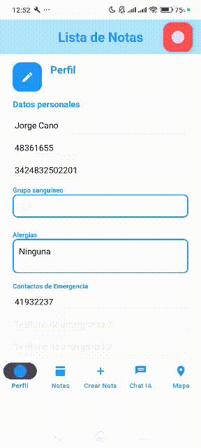
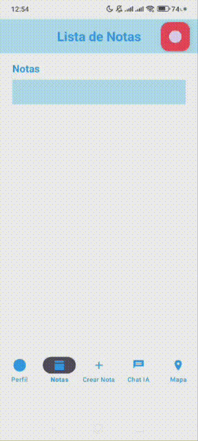
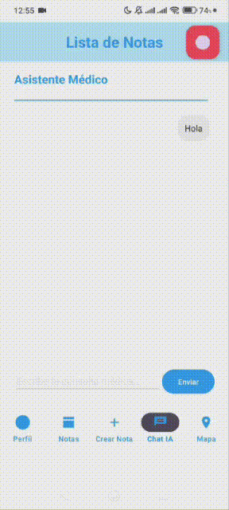

 <h1 style="text-align:center;">Aplicacion con N8N</h1>

## Descripción del proyecto

Aplicación para gestionar notas médicas, con opción de guardado en Google Drive. Implementada en Java con arquitectura sencilla, incluye autenticación con Google (`GoogleAuthManager`) y pantallas como `WelcomeActivity` y `MainActivity`. 

El usuario puede iniciar sesión con su cuenta de Google y compartir sus notas médicas mediante un flujo de N8N. Además, la app ofrece un chat IA para consultas médicas básicas y un mapa para localizar hospitales o farmacias cercanas.

## Cambios desde la propuesta inicial

Desde la primera version de la APP se hicieron algunos cambios menores dentro de la estructura y se agregaron algunas cosas.

Cambios: 
1. Ahora hay validaciones en las notas, ya no se pueden agregar notas vacias.
2. Ahora las notas crean automaticamente las notas en PDF para cuando se comparta o subir automaticamente.

Implementaciones:
1. Se agrego un inicio de sesion con Google, registrando la app en google cloud, teniendo un limite de hasta 100 usuarios logeados en la app.
2. Se agrego una conexion con N8N, con la posibilidad de hacer distintas cosas con la conexion.
3. Se agrego una funcion para compartir las notas que crea el usuario automaticamente a su cuenta de Google Drive, siempre y cuando haya iniciado sesion, si no, solo se guarda en local para cuando la comparta.

## Instrucciones de instalación

1. Clonar el repositorio.
   
2. Abrir el proyecto en Android Studio (recomendado: Narwhal 4 Feature Drop | 2025.1.4).
   
3. Ejecutar Gradle Wrapper desde la terminal o usar la interfaz de Android Studio.
   
4. Conectar un dispositivo o arrancar un emulador y ejecutar: `Run > app`.
   
5. (Opcional) Configurar credenciales de Google:
   - Añadir `google-services.json` a `app/`.
   - Configurar SHA-1 en la consola de Google Cloud.
     
6. (Opcional) Instalar el APK incluido en el repositorio.

## Requisitos

- Android Studio (versión recomendada: 2025.1.4 Narwhal).
- JDK 11 o superior.
- Android SDK (API level mínimo según `build.gradle`; recomendable SDK 31+).
- Conexión a Internet para dependencias y APIs externas.
- (Opcional) Cuenta de Google y acceso a Google Cloud / Drive API para sincronización.

## Dependencias principales 

```groovy
// add inside dependencies { ... }
implementation 'androidx.appcompat:appcompat:1.6.1'
implementation 'com.google.android.material:material:1.9.0'
implementation 'androidx.constraintlayout:constraintlayout:2.1.4'

// Google Sign-In
implementation 'com.google.android.gms:play-services-auth:20.7.0'

// Opcional: Google Drive / APIs (si usas sincronización)
implementation 'com.google.api-client:google-api-client-android:1.34.1'
implementation 'com.google.apis:google-api-services-drive:v3-rev20230308-2.0.0'
```

## Demostrativos

### Inicio de Sesion con google
Se agrego un inicio de sesion con google para poder acceder a los datos de google del usuario.

<p align="center">
  
</p>
<hr style="margin: 30px 0; border: 1px solid #ccc;">

### Perfil
Se añade una pestaña para el perfil del usuario donde agrega sus datos y puede conectar y desconectar con cuentas de google distintas.

<p align="center">
  
</p>
<hr style="margin: 30px 0; border: 1px solid #ccc;">

### Notas
El usuario puede añadir notas, eligiendo entre, notas medicas, recetas o notas generales de la persona, estas se muestran en una pestaña donde se muestra una parte desplegable para mostrar el contenido completo de la nota, el usuario ve opciones para poder eliminarlas o compartirla a otras persnas en un pdf con formato agradable, ademas, cuando se crea una nota, si el usuario inicio sesion, estas se comparten al usuario automaticamente a traves de Google Drive. 

<p align="center">
  
</p>
<hr style="margin: 30px 0; border: 1px solid #ccc;">

### Mapa y Chat IA
En estas dos pantallas se agrega un chat con una IA impulsada por Groq con um modelo de Open IA, esta solo responde consultas basicas sobre el contexto, saludos o gestiones medicas, en el mapa, se pueden localizar farmacias u hospitales que esten en un radio de 5km a la redonda del usuario, debajo del mapa se muestran tarjetas con el nombre del lugar, direccion y si hay dentro de google, el telefono de contacto. (No hay mucha presentacion de la IA porque se me acabaron los tokens)

<p align="center">
  
</p>
<hr style="margin: 30px 0; border: 1px solid #ccc;">

> ⚠️ Nota: El chat IA requiere clave de API Groq para funcionar; actualmente está deshabilitado en la versión de demostración.
